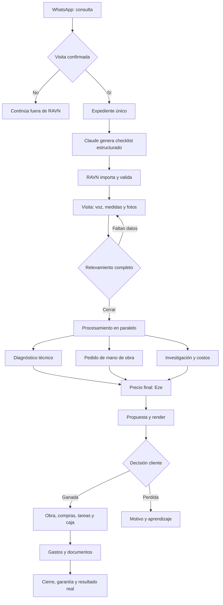
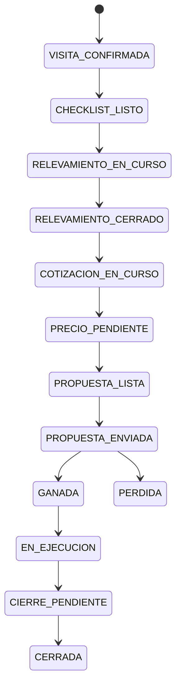

# Flujo operativo RAVN

**Versión:** 0.1  
**Fecha:** 2026-07-29  
**Estado:** diseño aprobado para implementación; todavía no describe funciones
ya desplegadas.

## Resultado buscado

Una oportunidad confirmada para visita debe avanzar con un único
`expediente_id` desde el relevamiento hasta el cierre, sin volver a copiar
medidas, fotos, alcances, precios ni documentos entre herramientas.

La prueba de que el sistema funciona es concreta:

1. Eze completa una visita desde el celular.
2. RAVN impide cerrarla si falta un dato crítico.
3. Al cerrarla, quedan preparados diagnóstico, pedido de mano de obra e insumos
   para cotizar.
4. La propuesta aprobada se convierte en obra sin recargar datos.
5. Gastos, remitos, recibos, adicionales y cierre quedan asociados al mismo
   expediente.

## Principio rector

> Claude piensa el contenido técnico; App RAVN gobierna la estructura y el
> estado; ChatGPT opera y redacta; Claude Code o Codex implementan con un único
> responsable por tarea; Eze decide precios y aprueba compromisos.

## Flujo de punta a punta

## Etapas, herramienta y entrega

| Etapa | Responsable / herramienta | Entrega persistida | Condición de salida |
|---|---|---|---|
| Consulta inicial | Eze por WhatsApp | Nada obligatorio | Eze confirma que habrá visita |
| Alta | App RAVN | Expediente con cliente, ubicación, alcance inicial y `expediente_id` | Estado `VISITA_CONFIRMADA` |
| Preparación | Claude/Cowork | `relevamiento.ravn.json` válido | Importación sin errores |
| Visita | App RAVN móvil | Respuestas, audios, fotos, medidas y faltantes | Todos los datos críticos completos |
| Cierre de relevamiento | Supabase + jobs de RAVN | Snapshot inmutable y tareas derivadas | Evento `RELEVAMIENTO_CERRADO` |
| Diagnóstico | Claude técnico + ChatGPT para presentación | Borrador con evidencia, hipótesis y faltantes | Revisión de Eze |
| Mano de obra | RAVN prepara; Eze aprueba envío | Mensaje y alcance trazables | Cotización recibida y vinculada |
| Investigación | Cotizador RAVN, datos internos, Fabel, Codex y Sismat | Fuentes, fecha, costos y supuestos | Costo consolidado |
| Precio | Eze | Costo, contingencia, estructura, margen, impuestos y precio final | Aprobación explícita |
| Propuesta | App RAVN / ChatGPT | Versión aprobada y PDF | Envío aprobado por Eze |
| Render opcional | SketchUp + generación de imagen de ChatGPT | Modelo, referencias y render vinculados | Aprobación visual |
| Conversión | App RAVN/Supabase | Obra, tareas, compras, acuerdos, cobros y baseline | Propuesta ganada |
| Ejecución | App RAVN + bot de gastos + oficina cloud | Gastos, adicionales, remitos, recibos y avance | Pendientes resueltos |
| Cierre | App RAVN + Obsidian | Entrega, garantía, desvíos y aprendizaje durable | Obra cerrada |

Fabel y Sismat son fuentes declaradas por Eze. Su modo exacto de integración
queda pendiente de verificar en el repositorio real; no se debe inventar una API
ni un acceso.

## Estados canónicos del expediente

Los nombres definitivos deben adaptarse al esquema existente cuando se abra el
repositorio real. No se crean tablas ni migraciones sólo para hacer coincidir
estos nombres.

## Expediente único

Todo artefacto debe llevar `expediente_id`:

- Relevamientos y sus versiones.
- Fotos, audios, planos y archivos.
- Diagnósticos y pedidos de mano de obra.
- Cotizaciones de proveedores y fuentes de mercado.
- Precio aprobado, propuesta y renders.
- Obra, tareas, plan de compras, acuerdos e hitos de cobro.
- Gastos, adicionales, remitos, recibos y actas.
- Cierre, garantía, resultado presupuestado versus real y aprendizaje.

Un chat, un PDF o un JSON de importación no son el expediente. Son entradas o
salidas vinculadas al registro canónico de Supabase.

## Relevamiento

El contrato de intercambio es
`schemas/relevamiento.ravn.schema.json`.
La instrucción versionada para Claude/Cowork es
`prompts/CLAUDE-CHECKLIST-RELEVAMIENTO.md`.

El checklist tiene tres momentos:

1. `antes_de_salir`: herramientas, seguridad, documentación y contexto.
2. `durante_visita`: medidas, fotos, instalaciones, patologías, logística,
   decisiones del cliente y exclusiones.
3. `antes_de_retirarse`: faltantes, confirmaciones y control final.

Claude puede crear preguntas particulares para cada caso, pero debe respetar:

- Identificadores estables.
- Tipos de respuesta definidos.
- Campos obligatorios y condiciones explícitas.
- Evidencia requerida.
- Motivo técnico de cada dato.
- Distinción entre observación, hipótesis y verificación pendiente.

El JSON transporta la definición del checklist. Las respuestas completadas y
sus evidencias viven en App RAVN/Supabase, vinculadas al expediente; no se
mantienen como archivo suelto.

## Automatizaciones

### Determinísticas

Se implementan con código de App RAVN y Supabase:

- Crear y enlazar el expediente.
- Validar campos críticos.
- Cambiar estados.
- Reservar numeración documental de forma atómica.
- Calcular importes y saldos.
- Crear tareas, reintentos y registro de eventos.
- Aplicar permisos e impedir dobles ejecuciones.

### Con IA

Se usan cuando hace falta interpretar contenido no estructurado:

- Crear preguntas específicas del checklist.
- Analizar voz, texto e imágenes.
- Redactar diagnóstico, alcance, exclusiones y propuesta.
- Clasificar gastos o mensajes con confirmación cuando corresponda.
- Detectar faltantes, contradicciones y riesgos.

### Aprobación humana obligatoria

Eze debe aprobar antes de:

- Enviar mensajes o documentos.
- Emitir un remito, recibo o certificado.
- Fijar o cambiar el precio final.
- Aplicar descuentos o aceptar un alcance.
- Comprar, contratar, cobrar, pagar o publicar.
- Anular documentos.
- Modificar esquema o datos de producción.

## Documentos administrativos

El proyecto RAVN web/cloud funciona como oficina administrativa móvil y conserva
las plantillas visuales. Mientras no exista integración con App RAVN:

- El documento se genera en cloud como borrador.
- Eze confirma emisión o envío.
- La numeración se reconcilia manualmente.

Objetivo de implementación:

- Registro documental en Supabase.
- Reserva atómica del número.
- Estados `BORRADOR`, `EMITIDO` y `ANULADO`.
- Versión, destinatario, fecha, archivo, actor y `expediente_id`.
- El historial del chat deja de ser la fuente de numeración.

Antes de emitir el próximo remito se debe reconciliar si 0003 y 0004 fueron
efectivamente usados; hoy existe información contradictoria.

## Coordinación Claude Code / Codex

1. Cada tarea tiene alcance, dueño y criterio de aceptación.
2. El implementador trabaja en una rama propia.
3. El revisor no modifica el mismo alcance mientras se implementa.
4. Antes de integrar, se revisan diff, migraciones, pruebas, permisos,
   idempotencia y rollback.
5. El handoff registra archivos cambiados, pruebas, riesgos y siguiente paso.

Claude Code es el implementador principal actual por decisión de Eze. Codex
actúa como revisor independiente y puede implementar módulos separados cuando
se le asignen explícitamente.

## Orden de implementación

### Fase 1 — columna vertebral

1. Auditar esquema y módulos reales.
2. Definir o reutilizar `expediente_id`.
3. Enlazar diagnóstico, cotización, presupuesto, obra, tareas y archivos.
4. Agregar historial de estados y eventos.

### Fase 2 — visita móvil

1. Importador del contrato de relevamiento.
2. Formulario móvil con texto, voz, medidas y fotos.
3. Validación de datos críticos.
4. Acción `Cerrar relevamiento`.

### Fase 3 — procesamiento

1. Diagnóstico técnico.
2. Pedido de mano de obra.
3. Investigación y consolidación de costos.
4. Revisión y precio final de Eze.

### Fase 4 — documentos y ejecución

1. Propuesta y conversión a obra.
2. Registro de documentos y numeración.
3. Gastos, adicionales, compras, cobros y tareas enlazados.
4. Cierre y comparación presupuestado versus real.

No se automatiza una fase si sus datos todavía no conservan el
`expediente_id`.

## Criterios técnicos transversales

- Jobs idempotentes: repetir un evento no duplica obras, documentos ni gastos.
- Cada job guarda estado, intentos, error, entrada, salida y timestamps.
- Precios con fuente y fecha; al aprobar la propuesta se congela el snapshot.
- Los secretos viven fuera del repositorio.
- Las migraciones son versionadas y separadas de las mutaciones operativas.
- n8n sólo conecta servicios externos cuando exista un caso concreto; no
  gobierna el estado central.
- Obsidian conserva decisiones y aprendizaje; Graphify deriva el mapa y nunca
  se edita manualmente.

## Pendientes antes de implementar

- Abrir el repositorio real de App RAVN.
- Verificar el esquema actual de Supabase y reutilizar estructuras existentes.
- Identificar cómo se invocan realmente Fabel y Sismat.
- Confirmar el comando de Graphify/Graphiti en la Mac.
- Reconciliar la numeración 0003/0004.
