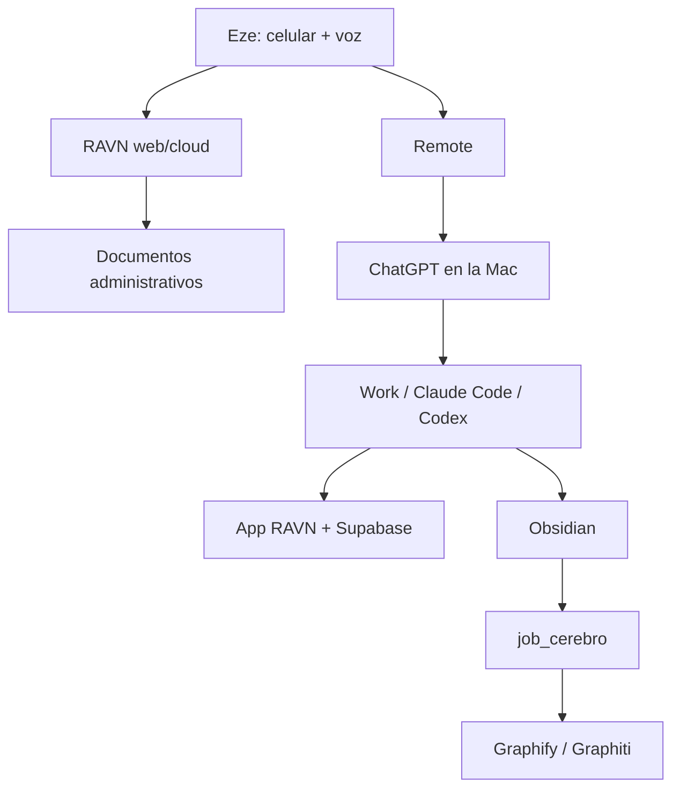

# Mapa del sistema RAVN

El flujo operativo detallado vive en `docs/RAVN-OPERATING-FLOW.md`. Este archivo
define límites de acceso y fuentes de verdad.

## Responsabilidad de cada capa

| Capa | Responsabilidad | No debe hacer |
|---|---|---|
| RAVN web/cloud | Oficina administrativa móvil, plantillas y borradores | Suponer acceso vivo a la Mac, el vault o Supabase |
| Código App RAVN | Producto, migraciones y pruebas | Alojar una copia del vault |
| App RAVN/Supabase | Estado operativo vivo | Guardar reflexión o conocimiento largo |
| Obsidian | Decisiones, contexto y aprendizaje | Reemplazar la base operativa |
| Graphify/Graphiti | Derivar relaciones del vault | Convertirse en una segunda fuente editable |
| Repositorio | Código, pruebas y arquitectura técnica | Duplicar el vault |
| Work/Claude Code/Codex | Leer, implementar, revisar y dejar trazabilidad | Inventar accesos o estados |
| Remote | Transportar instrucciones y aprobaciones | Dar acceso si la Mac está desconectada |

## Ciclo correcto de una actualización

1. Verificar el dato operativo en App RAVN/Supabase.
2. Tomar la decisión o realizar el cambio.
3. Registrar sólo el conocimiento durable en la nota fuente de Obsidian.
4. Ejecutar `job_cerebro`.
5. Verificar que Graphify/Graphiti refleje la nota.
6. Informar resultado, persistencia y siguiente paso.

Si el paso 4 no está configurado, detener la sincronización ahí e informar el
bloqueo. No editar el grafo a mano para “cerrar” el circuito.
